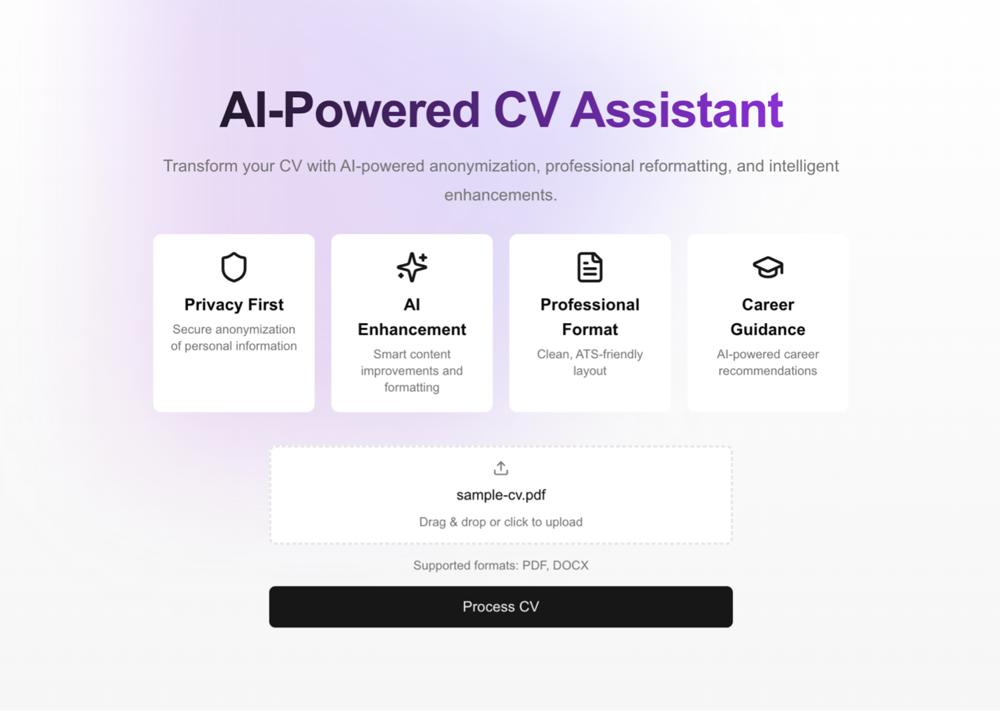
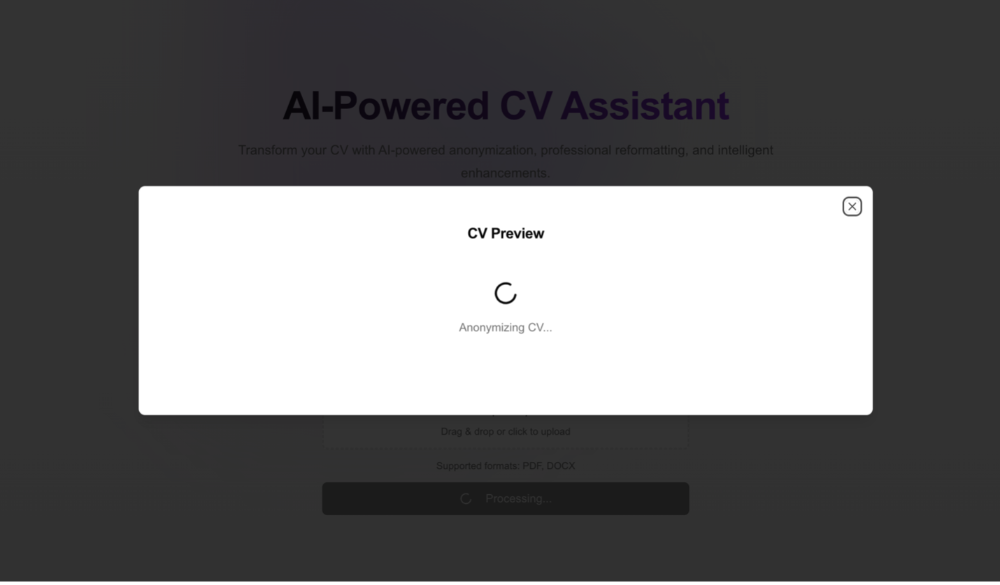
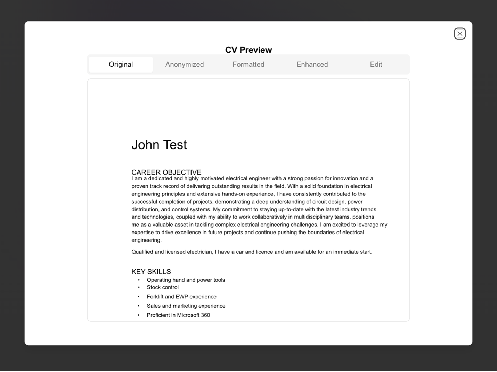
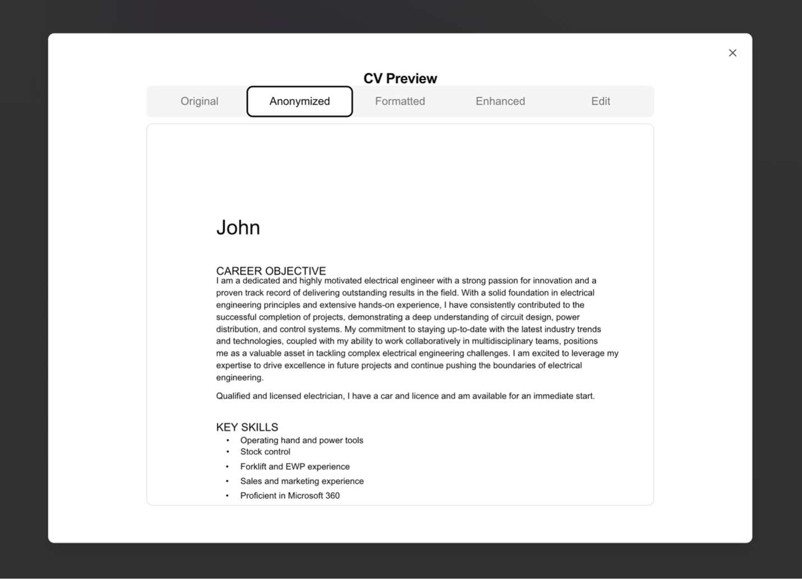
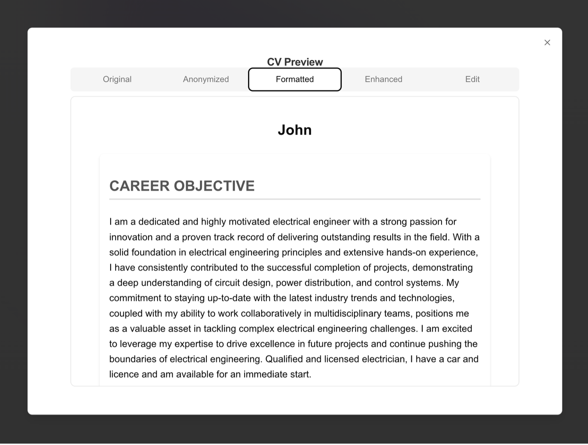
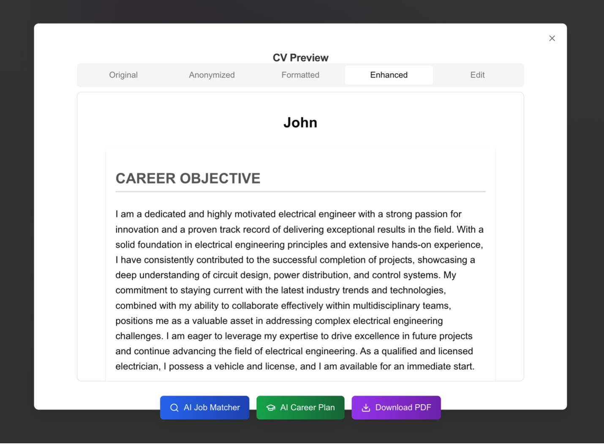
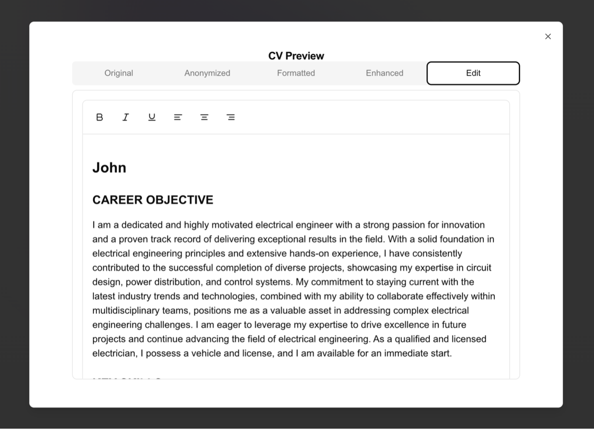
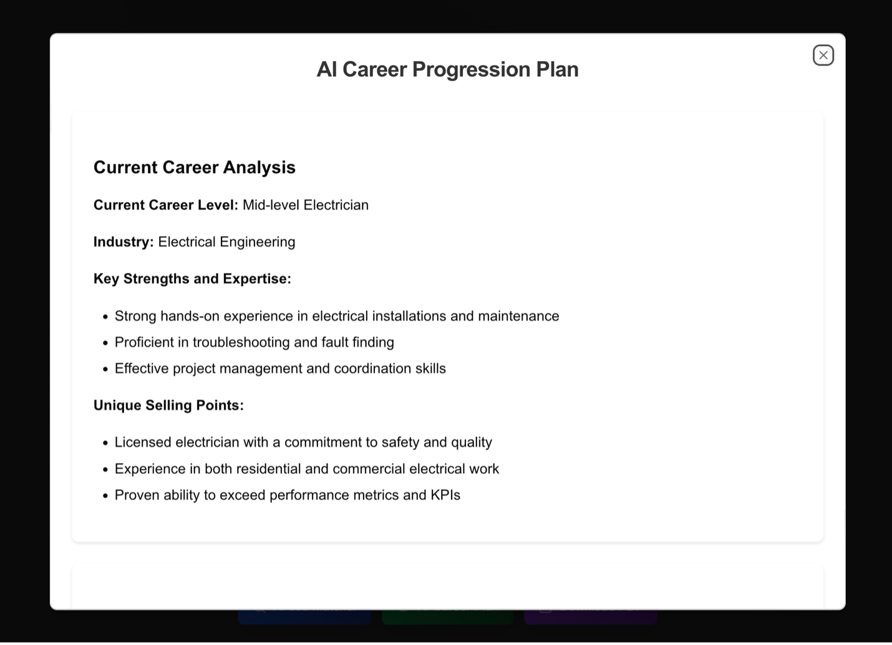
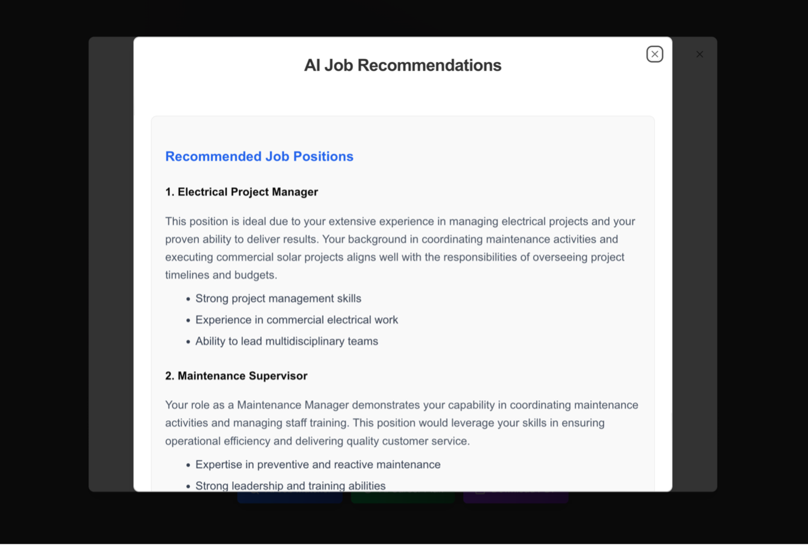

AI-Powered CV Assistant Documentation

Quick Start Guide

1.Prerequisites
-	Bun (latest version)
-	Node.js 18+
-	OpenAI API Key

2.Installation Steps : 

•	Clone & Install
-	Clone the repository
-	Run `bun install` to install dependencies

•	Environment Setup
-	Copy `.env.example` to `.env.local`
-	Add your OpenAI API key
-	Configure any additional environment variables

•	Development
-	Run `bun run dev` to start the development server
-	Access the application at [http://localhost:3000](http://localhost:3000)

3. Testing Guide

•	Running Tests
-	All Tests: `bun test`
-	Watch Mode: `bun test --watch`
-	Coverage: `bun test --coverage`

•	Test Structure
-	Unit tests for CV Agent (see `__tests__/services/AgentService.test.ts`)
-	Integration tests for CV processing flow
-	Component tests for rich text editor

 4. AI Agent Implementation

 Core Components

I.	CV Parser
a.	Handles multiple file formats (PDF, DOCX, TXT)
b.	Extracts text and maintains formatting
c.	Converts to standardized HTML structure

II.	CV Agent
a.	System-wide rules and capabilities defined in constructor
b.	Multi-step processing pipeline
c.	Token optimization and chunking for large documents

 Processing Pipeline

I.	Anonymization
a.	Removes personal identifiable information
b.	Preserves first names only
c.	Maintains professional credentials
d.	Keeps company and institution names

II.	Reformatting
a.	Structures content into clear sections
b.	Applies consistent HTML formatting
c.	Maintains semantic structure
d.	Adds professional styling

III.	Enhancement
a.	Improves language clarity
b.	Strengthens achievement descriptions
c.	Maintains factual accuracy
d.	Preserves key information

IV.	Career Analysis
a.	Job recommendations
b.	Career progression planning
c.	Skill gap analysis
d.	Development roadmap

 5.Security & Performance

•	Security Measures
-	Environment variable protection
-	Input sanitization
-	Rate limiting
-	Token optimization

•	Performance Optimization
-	Chunk processing for large documents
-	CSS optimization
-	Efficient state management
-	Error handling and recovery

 6.Additional AI Features

I.	Job Recommendations
a.	Analyzes CV content
b.	Matches skills to positions
c.	Provides detailed reasoning
d.	Suggests skill improvements

II.	Career Planning
a.	Short-term goals
b.	Long-term progression
c.	Skill development paths
d.	Industry insights

 
7.Troubleshooting

 Common Issues

I.	API Key Issues
a.	Verify key in .env.local
b.	Check API access
c.	Confirm rate limits

I.	File Processing
a.	Supported formats only
b.	Size limitations
c.	Format requirements

II.	Performance
a.	Large file handling
b.	Processing timeouts
c.	Memory management

 8.Support & Resources

•	Documentation
-	[Next.js](https://nextjs.org/docs)
-	[shadcn/ui](https://ui.shadcn.com/)
-	[OpenAI API](https://platform.openai.com/docs)
-	[Bun](https://bun.sh/docs)

•	Getting Help
-	GitHub Issues
-	Documentation
-	Community Support
-	Maintainer Contact

Agentic AI Approach Documentation
Overview

Our CV processing system implements a multi-step agent-like approach using the CVAgent class, which orchestrates several specialized tasks in a pipeline. The agent maintains conversation context and handles complex CV processing through distinct, specialized steps.

Core Agent Capabilities
•  Conversation Management
•  Maintains a system prompt defining agent capabilities
•  Handles context management for multi-step processing
•  Implements token management and chunking for large documents
•  Specialized Processing Steps
•  Anonymization
•  Reformatting
•  Enhancement
•  Career Analysis
•  Job Matching

Agent Pipeline Steps
1. Anonymization Agent
•  Removes personally identifiable information
•  Preserves first names only
•  Maintains professional credentials
•  Handles various name formats and structures

2. Reformatting Agent
•  Structures content into semantic sections
•  Applies consistent formatting rules
•  Maintains professional hierarchy

3. Enhancement Agent
•  Improves language and impact
•  Quantifies achievements
•  Maintains factual accuracy

4. Career Planning Agent
•  Analyzes current career level
•  Provides progression roadmap
•  Suggests skill development

Agent Intelligence Features
•  Adaptive Processing
•  Handles large documents through intelligent chunking
•  Manages token limits automatically
•  Preserves document structure across processing steps
•  Context Awareness
•  Maintains formatting consistency
•  Preserves critical information
•  Ensures professional tone
•  Error Handling
•  Graceful degradation for large documents
•  Token limit management
•  Format preservation safeguards

Integration with UI
The agent system is integrated with the UI through a step-by-step process, allowing users to:
•  View each transformation stage
•  Compare changes
•  Edit and download results
•  Generate career insights

Testing Approach
The agent system includes comprehensive testing:

This testing ensures:
•  Accurate anonymization
•  Proper formatting
•  Content enhancement quality
•  Career guidance accuracy
The agentic approach provides a sophisticated, multi-step processing pipeline that maintains context and ensures high-quality CV processing while providing valuable career insights.

The entire project gives the user a better format of their resume and also insights on the enhanced resume using AI.

Below are the screenshots of the entire working of the project :

Step 1 . Home Page

Step 2 :  Upload your CV

Step 3 : CV being parsed.

Step 4 : CV being anonymized using Agent AI

Step 5 : A well formatted CV

Step 6 : A well enhanced CV which has AI recommendation options and the user can also download the enhanced CV in a pdf.  

Step 7 : Rich text editor which allows the user to make final edit and also save changes, once saved the user can also download the final CV in a PDF.  

Step 8 : You have AI career plan Functionality , where based on the enhanced CV AI will recommend you a career progression plan.

Step 9 : Based on the Enhanced CV , AI will also recommend you jobs to apply , based on your enhanced resume.

